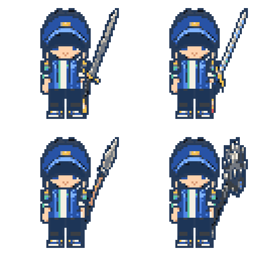

# Todo Quest

개인 일정과 할 일을 RPG 퀘스트와 캐릭터 성장으로 연결하는 로컬 우선 Android 앱입니다.

**현재 상태:** `0.1.0` · Android 전용 개발 버전


_위 이미지는 실제 앱 스크린샷이 아니라 Todo Quest의 Battle Map 분위기를 보여 주는 게임 비주얼·아트 미리보기입니다._

## 프로젝트 소개

Todo Quest는 일정 관리가 중심이고 RPG 요소는 꾸준한 실행을 돕는 피드백으로 사용됩니다.

- 일정과 할 일을 빠르고 명확하게 확인하고 관리합니다.
- 완료 행동을 전투, 보상, 캐릭터 성장으로 연결해 성취감을 강화합니다.
- 서버 없이 Room 기반 로컬 저장소에서 핵심 기능이 동작합니다.

## 주요 기능

- 월간 캘린더와 선택 날짜의 일간 목록에서 TODO를 생성·수정·삭제·완료합니다.
- 반복 없음·매일·매주·매월 일정을 지원하며, 반복 원본과 날짜별 occurrence를 분리해 해당 날짜만 완료 처리합니다.
- 일정별 알림을 예약하고 권한, 알림 채널 또는 exact alarm 문제가 생겨도 일정 저장·완료 같은 핵심 기능은 유지합니다.
- XP·골드·레벨·기본/파생 능력치를 제공하며, 완료 보상은 occurrence 단위 ledger와 전투 event로 중복 지급을 방지합니다.
- Calendar의 Battle Map에서 몬스터 전투, HP와 공격 피드백, 중상 상태, 설정 가능한 전투 효과음을 제공합니다.
- 장비 상점과 인벤토리에서 장비를 구매·장착·해제하고, 독립 캐릭터 레이어를 조합해 외형을 렌더링합니다.
- 저장된 몬스터 조우 이력으로 발견 상태를 계산하는 몬스터 도감을 제공합니다.

## 비주얼 미리보기

아래 이미지는 실제 화면 캡처가 아니라 캐릭터·장비 조합을 확인하기 위한 아트 미리보기입니다.

| 캐릭터 장착 아트 | 무기 조합 아트 |
|---|---|
|  |  |

## 기술 스택

| 기술 | 역할 |
|---|---|
| Kotlin | 앱과 도메인 로직 구현 |
| Jetpack Compose · Material 3 | 선언형 UI와 디자인 시스템 |
| ViewModel · Coroutines · Flow | 화면 상태, 비동기 작업, 반응형 데이터 흐름 |
| Room | 일정, 캐릭터, 전투, 장비의 로컬 영속 저장 |
| WorkManager | 전투·알림 상태의 best-effort 백그라운드 조정 |
| AlarmManager | occurrence 단위 정확한 일정 알림 예약 |

현재 빌드 기준은 JDK 17, compile/target SDK 35, min SDK 23입니다.

## 아키텍처

```text
UI → ViewModel → UseCase → Repository → Room / Android platform
```

- UI는 Room DAO, `AlarmManager`, `WorkManager`를 직접 호출하지 않습니다.
- 반복 일정은 원본과 날짜별 occurrence를 분리하고, 보상과 양방향 전투 event는 occurrence별 멱등 key로 처리합니다.
- 알림 권한이나 예약이 실패해도 일정 생성·완료·보상 등 핵심 로컬 기능은 계속 동작합니다.

세부 레이어와 transaction 경계는 [아키텍처 문서](docs/ARCHITECTURE.md)와 [ADR](docs/ADR.md)를 기준으로 합니다.

## 시작하기

### 준비 사항

- Android Studio 최신 안정 버전
- JDK 17
- Android SDK 35

### 저장소 열기

```powershell
git clone https://github.com/junhoh/todo-quest-android.git
cd todo-quest-android
```

Android Studio에서 저장소 루트를 열고 Gradle sync가 끝날 때까지 기다립니다.

### 기본 검증

저장소 루트의 Windows PowerShell에서 다음 명령을 실행합니다.

```powershell
.\gradlew.bat test --console=plain
.\gradlew.bat lint --console=plain
.\gradlew.bat assembleDebug --console=plain
```

emulator 또는 USB 디버깅이 활성화된 실제 기기가 준비된 경우에만 연결 테스트를 실행합니다.

```powershell
.\gradlew.bat connectedDebugAndroidTest --console=plain
```

자세한 도구 설정과 검증 절차는 [개발 환경 문서](docs/DEVELOPMENT.md)를 확인하세요.

## 문서 안내

상세 제품·아키텍처 계약은 아래 canonical 문서를 기준으로 합니다.

| 문서 | 책임 |
|---|---|
| [문서 인덱스](docs/README.md) | 전체 문서 탐색과 문서별 책임 안내 |
| [PRD](docs/PRD.md) | 제품 목표, 구현 범위와 제외 범위 |
| [아키텍처](docs/ARCHITECTURE.md) | 레이어, 데이터 흐름, 영속성과 transaction 경계 |
| [ADR](docs/ADR.md) | 주요 기술·제품 결정과 트레이드오프 |
| [UI 디자인 가이드](docs/UI_GUIDE.md) | 화면 구성, 한국어 표시, 접근성과 픽셀 아트 원칙 |
| [개발 환경](docs/DEVELOPMENT.md) | 로컬 도구, 빌드·테스트·진단 방법 |
| [게임 설계](docs/game-design/README.md) | 캐릭터 성장, 전투와 보상 설계 문서의 진입점 |

## 현재 범위

Todo Quest는 로컬 저장만 사용하는 Android 개발 버전입니다. 외부 Google Calendar 읽기·쓰기 연동, 계정·서버 동기화, 결제·광고, iOS·웹 버전은 현재 범위에 포함하지 않습니다.
